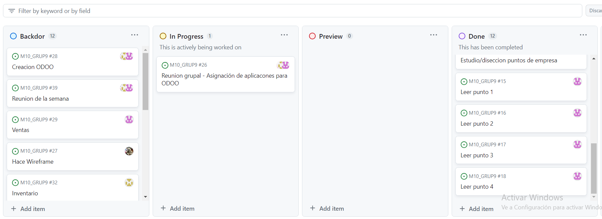

## BACKLOG

En la fase inicial del proyecto, llevamos a cabo la creación del primer BACKLOG, donde distribuimos entre los miembros del equipo las tareas iniciales. Cada integrante se encargó de revisar y comprender puntos específicos asignados de la empresa en cuestión. Este BACKLOG no solo incluyó las responsabilidades individuales, sino también programamos las reuniones planificadas con la empresa en cuestión.

## KANBAN

Concluida la etapa del BACKLOG y con un entendimiento profundo de las necesidades de la otra empresa, procedimos a identificar y asignar las aplicaciones necesarias entre los miembros del equipo.

En colaboración, desarrollamos el sistema Odoo, involucrando a todos los miembros del equipo en el proceso. Durante esta fase, incorporamos todas las aplicaciones que teníamos la intención de implementar.

Una vez completada la configuración inicial, cada miembro del equipo inició la implementación de sus respectivas aplicaciones. Además, establecimos una reunión semanal programada con representantes de la otra empresa para garantizar una comunicación constante y alineación de objetivos.

Mientras continuamos con el desarrollo, cada miembro del equipo sigue trabajando de manera individual en las aplicaciones asignadas, asegurando un progreso continuo y eficiente.

